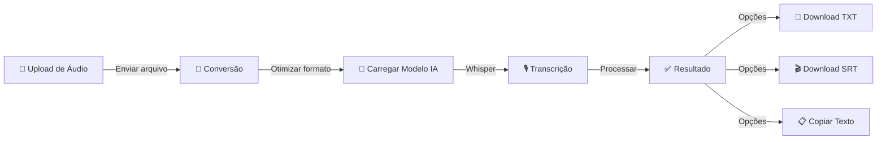

# 🪶 FeatherTranskript Web

Transcrição de áudio com IA baseada no modelo **Whisper** da OpenAI, otimizado com **Faster-Whisper**.

## ✨ Funcionalidades

- 🎙️ **Transcrição automática** de áudio com IA
- 🇧🇷 **Português otimizado** com reconhecimento de termos em inglês  
- 📁 **Múltiplos formatos**: MP3, OGG, AAC, WAV, FLAC
- 📝 **Dois modos**: texto corrido ou com timestamps
- ⏱️ **Barra de progresso** com estimativa de tempo
- 💾 **Download** em TXT ou SRT (legendas)

## 🔄 Workflow

Veja como o FeatherTranskript funciona:



## 🚀 Quick Start

### 1. Clonar e instalar

```bash
git clone https://github.com/seu-usuario/feather-transkript-web.git
cd feather-transkript-web
pip install -r requirements.txt
```

### 2. Instalar FFmpeg

**Linux:**
```bash
sudo apt update && sudo apt install ffmpeg
```

**Mac:**
```bash
brew install ffmpeg
```

**Windows:** [Baixar aqui](https://ffmpeg.org/download.html) e adicionar ao PATH

### 3. Executar

```bash
streamlit run app.py
```

Abre automaticamente em `http://localhost:8501`

## 📖 Como Usar

1. **Envie um áudio** em MP3, OGG, AAC, WAV ou FLAC
2. **Escolha o modo**: texto corrido ou com timestamps
3. **Selecione o modelo**: tiny (rápido) até large-v3 (preciso)
4. **Clique em "Iniciar Transcrição"**
5. **Baixe o resultado** em TXT ou SRT

## ⚙️ Modelos

| Modelo | Velocidade | Precisão | Tamanho |
|--------|-----------|----------|---------|
| tiny | ⚡ Muito rápido | ⭐ Básica | ~39 MB |
| base | 🚀 Rápido | ⭐⭐ Boa | ~74 MB |
| small | 🚗 Moderado | ⭐⭐⭐ Muito boa | ~244 MB |
| medium | 🐢 Lento | ⭐⭐⭐⭐ Excelente | ~769 MB |
| large-v3 | 🐌 Muito lento | ⭐⭐⭐⭐⭐ Máxima | ~1.5 GB |

## 🐳 Docker

```bash
docker build -t feather-transkript .
docker run -p 8501:8501 feather-transkript
```

## ☁️ Deploy

### Streamlit Cloud (recomendado)
1. Suba para o GitHub
2. Acesse [share.streamlit.io](https://share.streamlit.io)
3. Conecte o repositório

## 📄 Licença

MIT License — uso livre para pesquisa e estudo.

---

**Desenvolvido com ❤️ para a comunidade acadêmica**

Vinculado ao **GETMEP** — Grupo de Estudos Teórico-Metodológicos em Educação e Pesquisa

